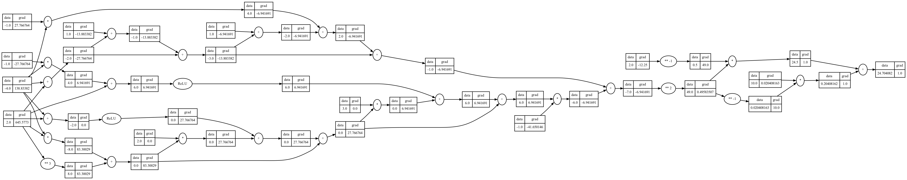

# micrograd.cr

This is a [Crystal](https://crystal-lang.org/) port of Andrej Karpathy's [micrograd](https://github.com/karpathy/micrograd). The original description is as follows, and is still accurate (except for the line numbers):

> A tiny Autograd engine (with a bite! :)). Implements backpropagation (reverse-mode autodiff) over a dynamically built DAG and a small neural networks library on top of it with a PyTorch-like API. Both are tiny, with about 100 and 50 lines of code respectively. The DAG only operates over scalar values, so e.g. we chop up each neuron into all of its individual tiny adds and multiplies. However, this is enough to build up entire deep neural nets doing binary classification, as the demo notebook shows. Potentially useful for educational purposes.

I ported this as part of my efforts to understand how neural networks work, and my desire to see more of this kind of work done with [Crystal](https://crystal-lang.org/). It is not any more complex than the original. However there are more lines partly because of adapting to Crystal and partly because I've documented this as an API.

## Installation

1. Add the dependency to your `shard.yml`:

   ```yaml
   dependencies:
     micrograd:
       github: nogginly/micrograd.cr
   ```

2. Run `shards install`

## Example Usage

Below is the "contrived" example ported to Crystal; you can also find it [here](examples/compat.cr).

```cr
require "micrograd"

alias NNFloat = Float32
alias NNValue = MicroGrad::Value(NNFloat)

a = NNValue[-4]
b = NNValue[2]
c = a + b
d = a * b + b**3
c += c + 1
c += 1 + c + (-a)
d += d * 2 + (b + a).relu
d += 3 * d + (b - a).relu
e = c - d
f = e**2
g = f / 2.0
g += 10.0 / f

puts "g: #{g} (expect data = 24.7041)" # prints 24.7041, the outcome of this forward pass
g.backward
puts "a: #{a} (expect grad = 138.8338)" # prints 138.8338, i.e. the numerical value of dg/da
puts "b: #{b} (expect grad = 645.5773)" # prints 645.5773, i.e. the numerical value of dg/db
```

## Examples

There are three examples [here](examples/) that can be run as follows:

* [compat.cr](examples/compat.cr)  | `shards run ex_compat`
* [lecture.cr](examples/compat.cr) | `shards run ex_lecture`
* [xor.cr](examples/compat.cr)     | `shards run ex_xor`

These generate a `.dot` file that illustrated the DAG of the model, and you can use Graphviz `dot` to generate the image to look at. Here's the DAG for the `compat.cr` example:



## Contributing

Bug reports and sugestions are welcome. Otherwise, at this time, this project is closed for code changes and pull requests. I appreciate your understanding.

This project is intended to be a safe, welcoming space for collaboration, and contributors are expected to adhere to the [code of conduct](https://www.contributor-covenant.org/version/1/4/code-of-conduct/).

## Contributors

* [nogginly](https://github.com/nogginly) - creator and maintainer
